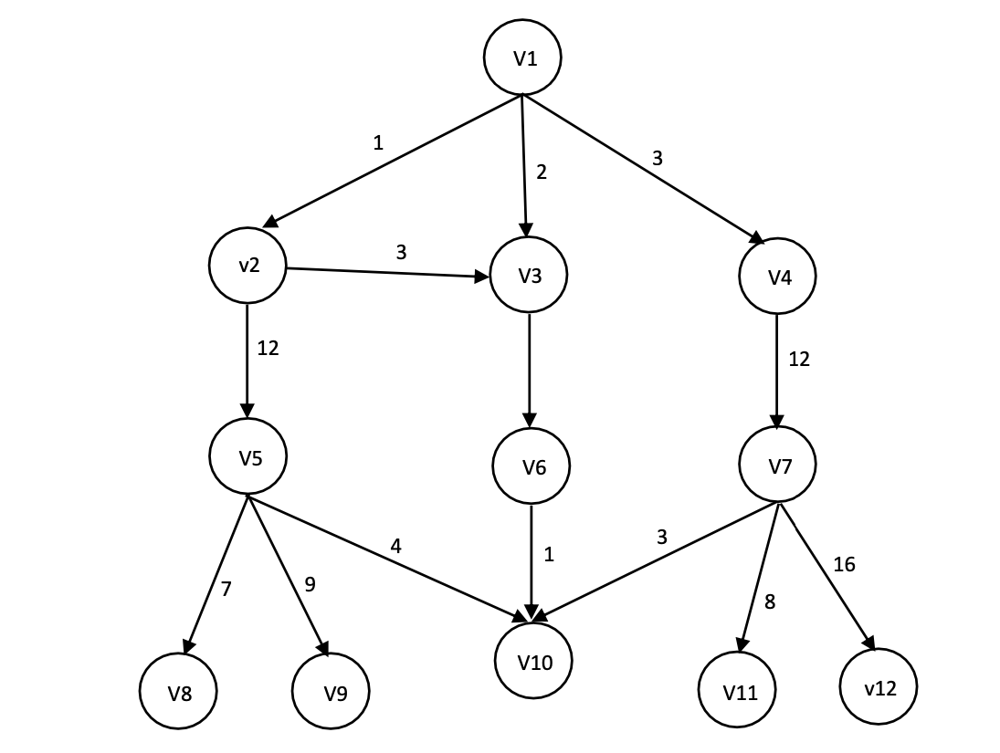

# Práctica 2 

Hecha por Maria Calvo Torres, Pedro Bereilh y Gonzalo Valdez Casis

## Como ejecutar el programa
Debemos tener instalado Apache Ant para comprobar si lo tenemos usar el comando:

````
ant -version 
`````

Para ejecutar la clase Main.java usar el comando:

````
ant run_main
````

> **_NOTA:_**  Ejecutar desde dentro de la carpeta java-algorithms-implementation.

## Grafo donde se genera el camnino 
- Queremos ir de v1 a v10 y usamos el algoritmo A*



## Preguntas sobre la práctica

**¿Qué variable representa la lista ABIERTA?**
- La variable openSet en la linea 44

**¿Qué variable representa la función g?**
- Respuesta

**¿Qué variable representa la función f?**
- Respuesta

**¿Qué método habría que modificar para que la heurística representara la distancia aérea entre vértices?**
- Respuesta

**¿Realiza este método reevaluación de nudos cuando se encuentra una nueva ruta a un determinado vértice? Justifique la respuesta.**
- Respuesta
